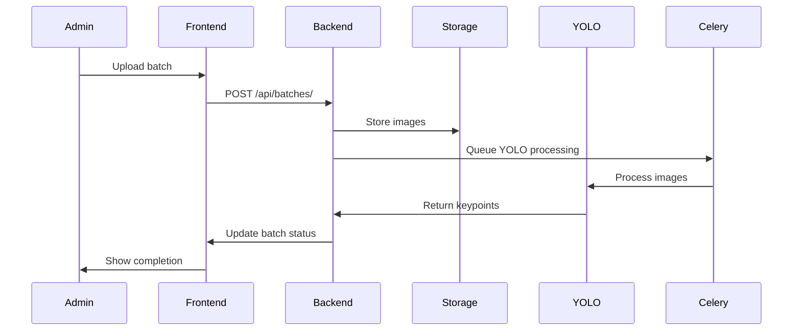
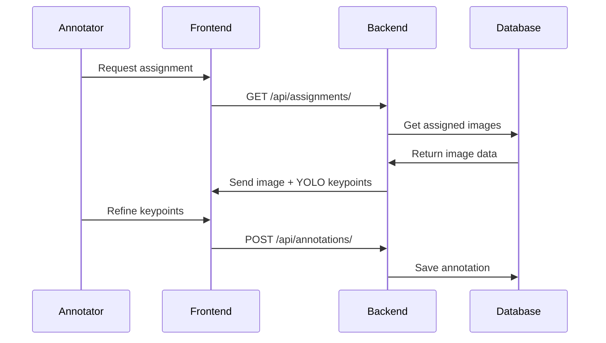
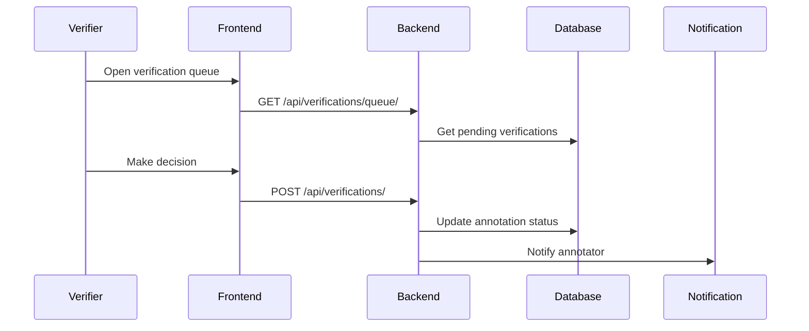

# Technical Architecture Documentation
## Keypoint Annotation Tool - Infant Pose Detection System

## System Overview

### Architecture Pattern
- **Microservices-Ready Monolith**: Structured for future microservices migration
- **Event-Driven Components**: Asynchronous processing for YOLO and notifications
- **API-First Design**: RESTful APIs with GraphQL ready architecture
- **Modular Frontend**: Component-based with state management

## Backend Architecture

### Django Project Structure
```
backend/
├── backend/                 # Main project configuration
│   ├── settings/           # Environment-specific settings
│   │   ├── base.py        # Common settings
│   │   ├── development.py # Development environment
│   │   ├── production.py  # Production environment
│   │   └── testing.py     # Testing environment
│   ├── urls.py            # Main URL configuration
│   ├── wsgi.py            # WSGI application
│   └── asgi.py            # ASGI application (for WebSockets)
├── user_auth/             # User management & authentication
├── images/                # Image upload & batch management
├── annotations/           # Annotation workflow
├── verifications/         # Verification process
├── analytics/             # Performance metrics & reporting
├── ml_models/             # ML model management
├── core/                  # Shared utilities
│   ├── models.py         # Base model classes
│   ├── permissions.py    # Custom permissions
│   ├── serializers.py    # Base serializers
│   ├── utils.py          # Utility functions
│   └── validators.py     # Custom validators
├── celery_config/        # Celery configuration
├── static/               # Static files
├── media/                # Media files (development)
└── requirements/         # Requirements files
    ├── base.txt
    ├── development.txt
    └── production.txt
```

### Key Components

#### 1. Authentication System
- **Custom User Model**: Extended Django user with role-based fields
- **JWT Implementation**: Using SimpleJWT with custom claims
- **Role-Based Permissions**: Custom permission classes for each role
- **Session Management**: Secure token refresh and logout

#### 2. Image Processing Pipeline
```python
# Asynchronous Processing Flow
Image Upload → File Validation → Storage → YOLO Queue → 
Processing → Keypoint Extraction → Database Update → 
Assignment Ready Notification
```

#### 3. Annotation Workflow Engine
- **State Machine**: Controlled status transitions
- **Assignment Algorithm**: Intelligent batch distribution
- **Progress Tracking**: Real-time progress updates
- **Quality Gates**: Automatic quality checks

#### 4. Verification System
- **Review Queue**: Priority-based verification queuing
- **Decision Engine**: Multi-criteria decision support
- **Feedback Loop**: Structured feedback to annotators
- **Escalation Logic**: Complex case handling

#### 5. Analytics Engine
- **Real-time Metrics**: Live performance dashboards
- **Batch Processing**: Scheduled metric calculations
- **Reporting**: Configurable report generation
- **Data Export**: Multiple format support

## Frontend Architecture

### React Application Structure
```
frontend/
├── src/
│   ├── components/           # Reusable UI components
│   │   ├── auth/            # Authentication components
│   │   ├── common/          # Shared components
│   │   ├── annotation/      # Annotation interface
│   │   ├── verification/    # Verification interface
│   │   └── admin/           # Admin components
│   ├── pages/               # Page components
│   │   ├── AuthPages/       # Login, register, etc.
│   │   ├── Dashboard/       # Role-based dashboards
│   │   ├── Annotation/      # Annotation workspace
│   │   └── Analytics/       # Reports and metrics
│   ├── hooks/               # Custom React hooks
│   │   ├── useAuth.ts       # Authentication logic
│   │   ├── useAnnotation.ts # Annotation state management
│   │   └── useWebSocket.ts  # Real-time updates
│   ├── services/            # API services
│   │   ├── api.ts           # Axios configuration
│   │   ├── auth.service.ts  # Authentication API
│   │   ├── image.service.ts # Image management API
│   │   └── annotation.service.ts # Annotation API
│   ├── store/               # State management
│   │   ├── auth/            # Authentication state
│   │   ├── annotation/      # Annotation state
│   │   └── ui/              # UI state
│   ├── types/               # TypeScript type definitions
│   ├── utils/               # Utility functions
│   └── constants/           # Application constants
├── public/                  # Static assets
└── tests/                   # Test files
```

### State Management Strategy
- **Context API**: Authentication and user state
- **Custom Hooks**: Feature-specific state logic
- **Local State**: Component-level state
- **Server State**: React Query for API data

### Key Frontend Components

#### 1. Annotation Interface
```typescript
// Interactive keypoint editor with advanced features
interface AnnotationEditor {
  imageViewer: {
    zoom: number;        // 0.1 to 5.0
    pan: Point;          // x, y coordinates
    rotation: number;    // 0 to 360 degrees
  };
  keypointEditor: {
    selectedKeypoint: number | null;
    dragMode: boolean;
    snapToGrid: boolean;
    showConnections: boolean;
    showConfidence: boolean;
  };
  aiAssistance: {
    showSuggestions: boolean;
    suggestionOpacity: number;
    acceptSuggestion: (keypointId: number) => void;
  };
}
```

#### 2. Real-time Updates
- **WebSocket Connection**: Live progress updates
- **Notification System**: Task assignments and completions
- **Collaborative Features**: Multiple users awareness
- **Auto-save**: Periodic annotation saving

## Data Flow Architecture

### 1. Image Upload Flow


### 2. Annotation Flow


### 3. Verification Flow


## Integration Architecture

### 1. YOLO Model Integration
```python
# Modular ML model integration
class MLModelInterface:
    def __init__(self, config: MLModelConfig):
        self.config = config
        self.model = self.load_model()
    
    def process_image(self, image_path: str) -> KeypointPrediction:
        # Standardized interface for all models
        pass
    
    def get_confidence_scores(self) -> Dict[int, float]:
        # Per-keypoint confidence
        pass
```

### 2. Storage Strategy
- **Development**: Local file system
- **Production**: Cloud storage (S3, GCS, Azure Blob)
- **CDN Integration**: Fast image delivery
- **Backup Strategy**: Automated backups

### 3. Caching Strategy
```python
# Multi-level caching
CACHES = {
    'default': {
        'BACKEND': 'django_redis.cache.RedisCache',
        'LOCATION': 'redis://localhost:6379/1',
        'OPTIONS': {
            'CLIENT_CLASS': 'django_redis.client.DefaultClient',
        }
    }
}

# Caching layers:
# 1. Browser cache (static assets)
# 2. CDN cache (images)
# 3. Redis cache (API responses, user sessions)
# 4. Database query cache
```

## Security Architecture

### 1. Authentication & Authorization
- **JWT Tokens**: Short-lived access tokens
- **Refresh Tokens**: Secure token renewal
- **Role-Based Access Control**: Fine-grained permissions
- **Session Management**: Secure session handling

### 2. Data Protection
- **Input Validation**: Comprehensive input sanitization
- **SQL Injection Prevention**: Parameterized queries
- **XSS Protection**: Content Security Policy
- **CSRF Protection**: Token-based CSRF protection

### 3. File Security
- **Upload Validation**: File type and size restrictions
- **Virus Scanning**: Malware detection
- **Access Controls**: Signed URLs for file access
- **Encryption**: Data encryption at rest and in transit

## Performance Architecture

### 1. Database Optimization
- **Indexing Strategy**: Optimized for common queries
- **Query Optimization**: N+1 query prevention
- **Connection Pooling**: Efficient database connections
- **Read Replicas**: Scaling read operations

### 2. Caching Strategy
- **Query Caching**: Frequently accessed data
- **Template Caching**: Rendered template caching
- **Static File Caching**: Long-term browser caching
- **API Response Caching**: Conditional caching

### 3. Async Processing
- **Celery Integration**: Background task processing
- **Task Queues**: Priority-based task scheduling
- **Result Backend**: Task result storage
- **Monitoring**: Task monitoring and alerting

## Scalability Architecture

### 1. Horizontal Scaling
- **Load Balancing**: Application server scaling
- **Database Sharding**: Data distribution strategy
- **Microservices Ready**: Future service separation
- **Container Orchestration**: Docker + Kubernetes

### 2. Vertical Scaling
- **Resource Optimization**: Memory and CPU efficiency
- **Database Tuning**: Performance optimization
- **Caching Layers**: Reduced database load
- **Asset Optimization**: Minimized asset sizes

## Monitoring Architecture

### 1. Application Monitoring
- **Error Tracking**: Sentry integration
- **Performance Monitoring**: APM tools
- **Log Aggregation**: Centralized logging
- **Health Checks**: System health monitoring

### 2. Business Metrics
- **User Analytics**: Usage patterns
- **Performance Metrics**: Annotation quality and speed
- **System Metrics**: Processing times and error rates
- **Custom Dashboards**: Role-specific metrics

## Deployment Architecture

### 1. Environment Strategy
- **Development**: Local development environment
- **Staging**: Production-like testing environment
- **Production**: High-availability production setup
- **DR Environment**: Disaster recovery setup

### 2. CI/CD Pipeline
```yaml
# Deployment pipeline stages
stages:
  - code_quality:     # Linting, type checking
  - testing:          # Unit, integration tests
  - security_scan:    # Security vulnerability scanning
  - build:            # Docker image building
  - deploy_staging:   # Staging deployment
  - e2e_tests:        # End-to-end testing
  - deploy_prod:      # Production deployment
  - health_check:     # Post-deployment verification
```

### 3. Infrastructure as Code
- **Terraform**: Infrastructure provisioning
- **Ansible**: Configuration management
- **Docker**: Containerization
- **Kubernetes**: Container orchestration

This technical architecture provides a robust, scalable foundation for the keypoint annotation system while maintaining flexibility for future enhancements and technology evolution.